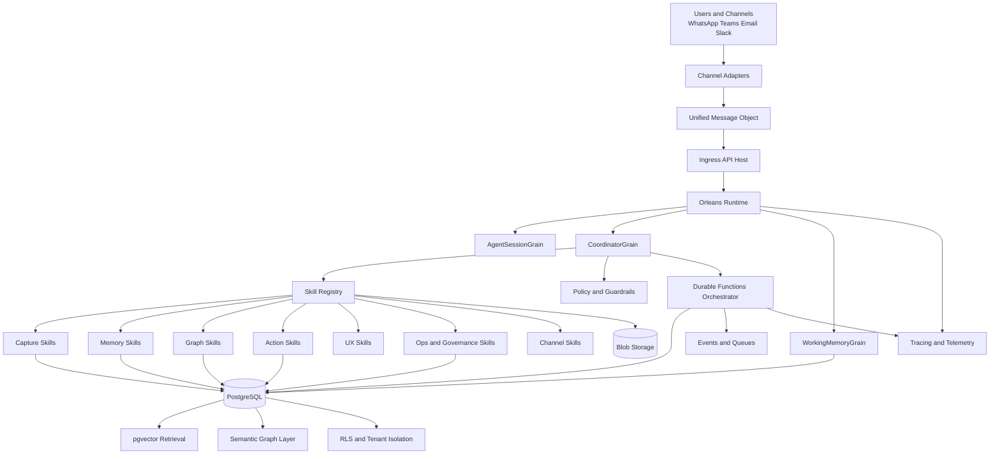
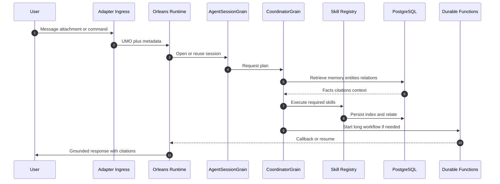
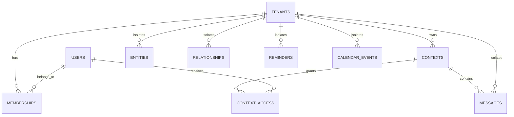
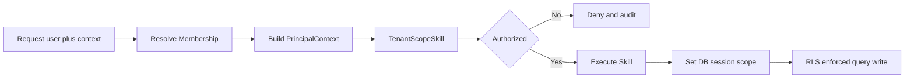
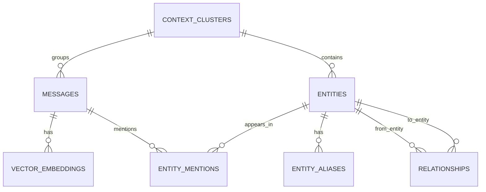

# Aluki Architecture Baseline

Version: 1.0
Status: Foundational
Date: 2026-06-21

## 1. Purpose

This document defines the baseline architecture for Aluki as a session-intelligent runtime platform.
It is designed to be the starting point for a new, clean branch and can be used as the source of truth for implementation planning.

The architecture unifies:
- Agentic runtime (custom)
- Orleans for live conversational sessions
- Durable Functions for long-running workflows
- PostgreSQL for durable memory, vectors, and semantic graph
- Skill Registry as the execution unit model
- Tenant-first identity and access model
- Grounded responses with provenance and citations
- Model routing policy (capability first, cost optimized by default)

## 2. Core Architectural Thesis

Aluki is not a feature-based chatbot backend.
Aluki is a runtime of intelligent sessions where:
- Skills are the atomic execution unit.
- Agents do not execute business work directly.
- Agents plan, select skills, orchestrate outcomes, and enforce policy.

This makes the platform modular, scalable, replaceable, and cost-governable.

## 3. Guiding Principles

1. Skill-First Execution
All system behavior is implemented through skills with explicit contracts.

2. Agent-as-Orchestrator
Agents coordinate and route execution but do not own concrete business side effects.

3. Tenant-Scoped by Default
No operation runs without tenant and context scope.

4. Grounded Memory
No recall response is emitted without provenance and citations.

5. Cost-Aware Intelligence
Default to value models; escalate to premium models only when needed.

6. Durable Process Separation
Session life and process life are separated:
- Orleans for live state.
- Durable Functions for long-lived workflows.

7. Observable and Governed
Every skill emits telemetry and is constrained by policy and budget controls.

## 4. Global Architecture

## 5. Execution Flow

## 6. Solution Layers

### 6.1 Ingress Layer
Responsibilities:
- Channel adapters (WhatsApp, Teams, Email, Slack)
- Message normalization into UMO
- Input validation, signature checks, transport safety

### 6.2 Orleans Session Layer
Main grains:
- AgentSessionGrain: live session state
- CoordinatorGrain: routing, planning, orchestration
- WorkingMemoryGrain: short-term operational memory

### 6.3 Skill Layer
Every skill must define:
- Input schema
- Output schema
- Side effects
- Idempotency behavior
- Tenant scope requirements
- Telemetry contract
- Policy checks

### 6.4 Workflow Layer (Durable Functions)
Use for:
- Timers
- Wait for external events
- Confirmations and approvals
- Retry and backoff policies
- Long-running orchestrations and resume

### 6.5 Data Layer (PostgreSQL)
Use PostgreSQL as unified durable substrate for:
- Memory records
- pgvector embeddings
- Entity graph and relationships
- Context clustering
- Audit artifacts
- Row-level security

### 6.6 Observability and Policy Layer
Cross-cutting controls:
- OpenTelemetry and App Insights
- Audit logs
- Budget and quota policies
- Consent and opt-out controls
- Dedupe and idempotency enforcement
- Provenance enforcement

## 7. Skill Taxonomy

### 7.1 Ingress and Capture
- WhatsAppInboundSkill
- TeamsInboundSkill
- EmailInboundSkill
- DocumentIngestSkill
- MediaTranscriptionSkill
- ImageOcrSkill
- AttachmentStoreSkill
- CaptureMessageSkill
- UnsupportedContentSkill

### 7.2 Memory and Retrieval
- RecallSkill
- EmbeddingIndexSkill
- ExtractionSkill
- MemorySynthesisSkill
- CitationRenderSkill
- SummarizeConversationSkill

### 7.3 Semantic Graph
- EntityResolveSkill
- EntityLinkSkill
- RelationshipUpsertSkill
- ContextClusterSkill
- GraphTraverseSkill
- GraphQuerySkill
- GraphExplainSkill

### 7.4 Operational Actions
- LinkCaptureSkill
- ReminderCreateSkill
- ReminderConfirmSkill
- CalendarCreateSkill
- CalendarUpdateSkill
- WorkflowResumeSkill
- RetryBackoffSkill

### 7.5 Conversational UX
- ConversationClarifySkill
- FollowUpQuestionSkill
- GreetingSkill
- SmallTalkSkill
- OutOfScopeSkill

### 7.6 Governance and Security
- IdempotencyGuardSkill
- TenantScopeSkill
- ConsentOptOutSkill
- AuditLogSkill
- BudgetPolicySkill
- PolicyDecisionSkill

### 7.7 Runtime Orchestration
- PlannerSkill
- AgentSelectionSkill
- HandoffSkill
- SkillCompositionSkill
- StateCheckpointSkill

## 8. Formal Skill Catalog (Minimum)

| Skill | Role | Side effects | Domain |
|---|---|---|---|
| CaptureMessageSkill | Persist inbound message | Yes | Capture |
| RecallSkill | Retrieve grounded facts | No | Memory |
| CitationRenderSkill | Render citation-backed answer | No | Memory UX |
| EntityResolveSkill | Entity disambiguation | No | Graph |
| EntityLinkSkill | Link mentions to entities | Yes | Graph |
| RelationshipUpsertSkill | Persist entity edges | Yes | Graph |
| ContextClusterSkill | Group context by topic | Yes | Graph |
| GraphTraverseSkill | Multi-hop relationship traversal | No | Graph |
| GraphExplainSkill | Explain relation chains | No | Graph |
| LinkCaptureSkill | Capture URL plus metadata | Yes | Capture Graph |
| ReminderCreateSkill | Create reminder | Yes | Action |
| ReminderConfirmSkill | Resolve pending confirmations | Yes | Action |
| CalendarCreateSkill | Create calendar event | Yes | Action |
| CalendarUpdateSkill | Update cancel event | Yes | Action |
| ExtractionSkill | Extract facts tasks decisions | Yes | Memory |
| MemorySynthesisSkill | Synthesize distributed facts | Yes | Memory |
| EmbeddingIndexSkill | Generate embeddings | Yes | Memory |
| ConsentOptOutSkill | Process STOP or ALTO | Yes | Governance |
| IdempotencyGuardSkill | Prevent duplicates | Yes | Governance |
| TenantScopeSkill | Enforce tenant context | Yes | Governance |
| AuditLogSkill | Persist audit trail | Yes | Governance |
| BudgetPolicySkill | Cost and latency policy checks | No | Governance |

## 9. Identity, Tenancy, and Access Model

Everything operates under a Tenant.
Tenant types:
- INDIVIDUAL
- ORGANIZATION

Core concepts:
- Tenant
- User
- Membership
- Context
- ContextAccess
- Artifacts

### 9.1 Authorization flow

### 9.2 Required fields on every artifact

Mandatory fields:
- tenant_id
- context_id
- created_by_user_id
- source_channel
- provenance_message_id when applicable

Golden rules:
- No operation without PrincipalContext.
- No query without tenant scope.
- No recall response without provenance.

## 10. Data Architecture

Data responsibilities:
- PostgreSQL stores durable memory and graph records.
- pgvector powers semantic retrieval.
- RLS enforces tenant and user boundaries.

## 11. Model Routing Architecture (Capability first, Cost optimized)

### 11.1 Strategy

- Primary objective: best capability for critical tasks.
- Operating objective: minimum cost for daily traffic.
- Mechanism: confidence-based escalation and automatic de-escalation.

### 11.2 Recommended model matrix by skill

| Skill or task | Best capability | Best value | Ultra low fallback |
|---|---|---|---|
| Intent routing | GPT-5.4-mini | GPT-4.1-nano | GPT-5-nano |
| Fast classification | GPT-5.4-mini | GPT-4.1-nano | GPT-5-nano |
| Structured extraction JSON | GPT-5.4 | GPT-4o-mini | GPT-5.4-nano |
| Complex multi-entity extraction | GPT-5.5 | GPT-5.4-mini | GPT-4.1-mini |
| Multi-step planning | GPT-5.5 | GPT-5.4 | GPT-5.4-mini |
| RAG synthesis with citations | GPT-5.4-mini | GPT-4.1-mini | GPT-4.1-nano |
| Embeddings retrieval | text-embedding-3-large | text-embedding-3-small | text-embedding-3-small lower dims |
| OCR and vision | GPT-4o | GPT-4o-mini | Classic OCR plus retry |
| STT | gpt-4o-transcribe | gpt-4o-mini-transcribe | whisper |
| TTS | gpt-audio-1.5 | gpt-4o-mini-tts | tts |
| Realtime voice | GPT-Realtime-2 | GPT-realtime-mini | gpt-realtime-1.5 |
| Moderation | Content Safety plus LLM for borderline | Content Safety | Deterministic rules |
| Translation | Azure AI Translator | Azure AI Translator | LLM only for nuanced rewriting |

### 11.3 Routing policy

Default path (70 to 90 percent traffic):
- Use value models.

Escalate when:
- Confidence below threshold.
- High ambiguity.
- Critical business operation.
- Premium tenant tier.

De-escalate when:
- Stable high confidence over time.
- Budget risk detected.
- Task can run async or batch.

Platform guidance:
- Prefer Foundry model-router as primary runtime selector.
- Avoid preview models in production-critical paths.

### 11.4 Cost levers

- Batch API for non-interactive workloads.
- Prompt caching for repeated long prompts.
- Embed-once policy.
- Response reuse via request hash.
- Budget controls and circuit breakers per tenant.

## 12. Security, Governance, and Compliance

- Row-level security mandatory on all data access.
- Idempotency and dedupe enforced per message and per skill.
- Consent and opt-out treated as first-class policy.
- Audit trail for all side effects.
- PolicyDecisionSkill is central enforcement gate.

## 13. Observability and SLO

### 13.1 Required telemetry dimensions
- request_id
- session_id
- tenant_id
- context_id
- skill_name
- model_name
- latency_ms
- cost_estimate
- success_or_failure
- retry_count

### 13.2 Suggested SLO
- P95 synchronous response less than or equal to 2 seconds.
- Skill error rate below 1 percent.
- Daily cost per tenant within configured budget envelope.

## 14. Implementation Baseline Scope

Phase 1 baseline implementation should include:
- Runtime skeleton (Ingress, Orleans grains, Durable orchestration entry points)
- Skill Registry contract and core dispatcher
- PrincipalContext and TenantScope enforcement
- PostgreSQL schema baseline with tenant and context fields
- RLS foundation
- Core memory and citation path
- Minimal model routing layer
- Telemetry and audit scaffolding

## 15. Final Positioning

Aluki is a session-intelligent runtime platform with:
- Orleans for conversation lifecycle
- Durable Functions for process lifecycle
- Skills as action and capability primitives
- PostgreSQL as durable memory and relationship brain
- Tenant-safe governance and policy-by-design

This baseline is the architecture starting point for a clean branch build.
