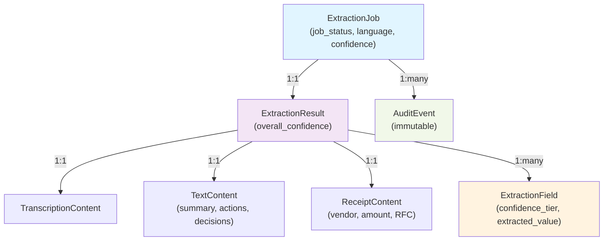

# Data Model: AI Extraction

**Date**: 2026-06-21 | **Feature**: SB-004 AI Extraction

## Core Entities

### Extraction Job

Represents a single extraction request (audio, text, or image).

```yaml
ExtractionJob:
  id: UUID
  tenant_id: UUID (fk: Tenant)
  context_id: UUID? (fk: PrincipalContext, optional for personal)
  created_by: UUID (fk: Principal)
  
  # Job metadata
  job_status: enum {pending, processing, completed_success, completed_with_warnings, failed}
  created_at: DateTime
  started_at: DateTime?
  completed_at: DateTime?
  
  # Input details
  input_type: enum {audio, text, image}
  input_source: enum {whatsapp, voice_note, clipboard, upload}
  input_size_bytes: int
  
  # Processing metadata
  detected_language: string (e.g., "es-MX", "en-US", "es-MX:en-US" for bilingual)
  language_confidence: float [0.0-1.0]
  processing_time_ms: int?
  segment_count: int (for long audio: number of chunks)
  completion_pct: float [0.0-1.0] (progress)
  
  # Error handling
  error_category?: enum {unsupported_format, language_undetectable, ocr_failed_all, api_timeout, rate_limited, internal_error}
  error_message?: string
  
  # Audit & RLS
  tenant_scope_id: UUID (denormalized, for RLS)
  audit_trail: array[AuditEvent]
  
  # Idempotency
  idempotency_key: string (unique within tenant)
  
  Constraints:
    - (tenant_id, idempotency_key) unique
    - completed_at IS NOT NULL → job_status IN (completed_success, completed_with_warnings, failed)
    - job_status = processing → started_at IS NOT NULL
    - job_status = failed → error_category IS NOT NULL
```

### Extraction Result (polymorphic by input_type)

Base structure for all extraction outputs.

```yaml
ExtractionResult:
  id: UUID
  job_id: UUID (fk: ExtractionJob, unique)
  extraction_type: enum {transcription, text_summary, receipt_ocr}
  
  # Confidence and metadata
  overall_confidence: float [0.0-1.0]
  extraction_fields: array[ExtractionField]
  extracted_at: DateTime
  model_info: object
    provider: string (e.g., "Azure.CognitiveServices", "Azure.OpenAI", "Google.Vision")
    model_name: string (e.g., "whisper", "gpt-4", "form-recognizer-v4")
    version: string
  
  # Linked data
  raw_content: object (polymorphic: TranscriptionContent | TextContent | ReceiptContent)
  
  Relationships:
    - ExtractionJob.id = ExtractionResult.job_id (1:1)
```

### Extraction Field

Individual extracted fact with confidence and provenance.

```yaml
ExtractionField:
  id: UUID
  extraction_result_id: UUID (fk: ExtractionResult)
  
  # Field identity and value
  field_name: string (e.g., "transcription_text", "action_item", "receipt_amount", "tax_id_rfc")
  field_type: enum {text, number, date, entity, decision_item, amount}
  extracted_value: any (polymorphic: string | number | date | Entity | DecisionItem | Money)
  
  # Confidence and sourcing
  confidence_score: float [0.0-1.0]
  confidence_tier: enum {high, medium, low}
  confidence_justification?: string (why medium/low, e.g., "partially obscured in image")
  
  # Position/segment reference (for audio/long text)
  source_segment_index?: int (0-based segment in multi-segment input)
  source_segment_timestamp?: object {start_ms: int, end_ms: int} (for audio)
  source_text_span?: object {start_char: int, end_char: int} (for text)
  
  # Language context
  detected_language?: string (if multilingual extraction)
  
  # Audit
  created_at: DateTime
  
  Constraints:
    - confidence_score in [0.0, 1.0]
    - If confidence_score >= 0.85 → confidence_tier = high
    - If 0.70 <= confidence_score < 0.85 → confidence_tier = medium
    - If confidence_score < 0.70 → confidence_tier = low
    - If field_type = entity → extracted_value is Entity
    - If field_type = decision_item → extracted_value is DecisionItem
    - If field_type = amount → extracted_value is Money
```

### Transcription Content

Extracted from audio input.

```yaml
TranscriptionContent:
  id: UUID
  extraction_result_id: UUID (fk: ExtractionResult, unique)
  
  # Raw transcription
  full_transcription: text
  language: string (e.g., "es-MX", "en-US")
  language_confidence: float [0.0-1.0]
  
  # Multi-segment metadata
  segments: array[TranscriptionSegment]
    - id: UUID
    - segment_index: int
    - text: string
    - start_ms: int
    - end_ms: int
    - detected_language: string
    - language_confidence: float
    - speaker?: string (if multi-speaker audio: "speaker_0", "speaker_1")
  
  # Processing
  audio_duration_ms: int
  sample_rate_hz?: int
  
  Relationships:
    - ExtractionResult.raw_content = TranscriptionContent (1:1)
    - TranscriptionSegment array: ordered by segment_index
```

### Text Summary & Actions

Extracted from text or forwarded conversation.

```yaml
TextContent:
  id: UUID
  extraction_result_id: UUID (fk: ExtractionResult, unique)
  
  # Extraction structure
  summary: string (main narrative)
  
  action_items: array[ActionItem]
    - id: UUID
    - action: string (imperative)
    - owner?: string (person responsible)
    - due_date?: date
    - priority?: enum {high, medium, low}
    - confidence: float [0.0-1.0]
  
  decisions: array[Decision]
    - id: UUID
    - decision_statement: string
    - rationale?: string
    - confidence: float [0.0-1.0]
  
  entities: array[Entity]
    - id: UUID
    - name: string
    - entity_type: enum {person, organization, location, product, event}
    - mentions?: int (how many times mentioned)
  
  # Language
  detected_language: string
  language_confidence: float [0.0-1.0]
  
  # Metadata
  original_length_chars: int
  summary_ratio: float (summary_length / original_length)
  
  Relationships:
    - ExtractionResult.raw_content = TextContent (1:1)
```

### Receipt Content

Extracted from receipt image via OCR.

```yaml
ReceiptContent:
  id: UUID
  extraction_result_id: UUID (fk: ExtractionResult, unique)
  
  # Extracted fields
  vendor_name: string?
  vendor_confidence: float [0.0-1.0]?
  
  transaction_date: date?
  transaction_date_confidence: float [0.0-1.0]?
  
  transaction_time: time?
  transaction_time_confidence: float [0.0-1.0]?
  
  # Monetary fields
  subtotal: Money?
  subtotal_confidence: float [0.0-1.0]?
  
  tax_amount: Money?
  tax_amount_confidence: float [0.0-1.0]?
  
  total_amount: Money (required, extracted or computed)
  total_amount_confidence: float [0.0-1.0]
  
  # Fiscal/Tax fields (Mexico-specific)
  tax_id_rfc: string? (Mexican RFC format: "ABC123456XYZ")
  tax_id_rfc_confidence: float [0.0-1.0]?
  
  tax_id_folio?: string (CFDI folio if present)
  
  # OCR metadata
  ocr_confidence: float [0.0-1.0] (overall text readability)
  ocr_fallback_used: bool (true if text-only OCR after structured failed)
  is_unreadable: bool (both structured and text OCR failed)
  manual_review_required: bool
  
  # Image reference
  image_reference: string (pointer to blob storage, not raw image)
  image_hash: string (sha256 for deduplication)
  
  # Currency
  currency_code: string (e.g., "MXN", "USD")
  currency_confidence: float [0.0-1.0]
  
  Relationships:
    - ExtractionResult.raw_content = ReceiptContent (1:1)
  
  Constraints:
    - If is_unreadable = true → total_amount_confidence < 0.70 AND manual_review_required = true
    - total_amount IS NOT NULL
    - If currency detected → currency_code IS NOT NULL
```

### Money

Value type for monetary amounts.

```yaml
Money:
  amount: decimal(precision=18, scale=2)
  currency: string (ISO 4217 code, e.g., "MXN", "USD")
  
  Validation:
    - amount >= 0
    - currency in [valid ISO 4217 codes]
```

### Entity

Extracted named entity.

```yaml
Entity:
  id: UUID
  name: string
  entity_type: enum {person, organization, location, product, event, date, amount}
  confidence: float [0.0-1.0]
  
  # Context
  mentions_in_text?: int
  first_mention_position?: int
  
  # Optional attributes by type
  normalized_form?: string (standardized name)
```

### Decision

Extracted decision or conclusion.

```yaml
Decision:
  id: UUID
  statement: string
  rationale?: string
  confidence: float [0.0-1.0]
  source_segment?: string (which part of input led to this decision)
```

### ActionItem

Extracted action with optional owner and due date.

```yaml
ActionItem:
  id: UUID
  action: string (imperative phrasing)
  owner?: string (person or role)
  due_date?: date
  priority?: enum {high, medium, low}
  confidence: float [0.0-1.0]
  notes?: string
```

### Audit Event

Immutable audit record per extraction job.

```yaml
AuditEvent:
  id: UUID
  job_id: UUID (fk: ExtractionJob)
  event_type: enum {
    job_created,
    job_started,
    language_detected,
    extraction_completed,
    extraction_failed,
    confidence_tier_assigned,
    manual_review_flagged,
    result_persisted,
    error_recorded
  }
  created_at: DateTime (event timestamp)
  actor: UUID (principal who triggered or system)
  details: object (event-specific metadata)
  
  Constraints:
    - Immutable after creation
    - Ordered by created_at
```

---

## Database Schema

### Tables

```sql
-- Core extraction job
extraction_jobs (
  id UUID PRIMARY KEY,
  tenant_id UUID NOT NULL,
  context_id UUID,
  created_by UUID NOT NULL,
  job_status VARCHAR NOT NULL,
  created_at TIMESTAMP NOT NULL,
  started_at TIMESTAMP,
  completed_at TIMESTAMP,
  input_type VARCHAR NOT NULL,
  input_source VARCHAR NOT NULL,
  input_size_bytes INT,
  detected_language VARCHAR,
  language_confidence FLOAT,
  processing_time_ms INT,
  segment_count INT,
  completion_pct FLOAT,
  error_category VARCHAR,
  error_message TEXT,
  tenant_scope_id UUID NOT NULL,
  idempotency_key VARCHAR NOT NULL,
  UNIQUE(tenant_id, idempotency_key),
  FOREIGN KEY (tenant_id) REFERENCES tenants(id),
  FOREIGN KEY (context_id) REFERENCES principal_contexts(id),
  FOREIGN KEY (created_by) REFERENCES principals(id)
);
CREATE INDEX ON extraction_jobs(tenant_id, created_at DESC);
CREATE INDEX ON extraction_jobs(job_status, created_at);
CREATE INDEX ON extraction_jobs(tenant_id, idempotency_key);

-- Extraction results (polymorphic)
extraction_results (
  id UUID PRIMARY KEY,
  job_id UUID NOT NULL UNIQUE,
  extraction_type VARCHAR NOT NULL,
  overall_confidence FLOAT,
  extracted_at TIMESTAMP,
  model_info JSONB,
  raw_content JSONB NOT NULL,  -- stores TranscriptionContent | TextContent | ReceiptContent
  FOREIGN KEY (job_id) REFERENCES extraction_jobs(id)
);
CREATE INDEX ON extraction_results(job_id);

-- Extracted fields
extraction_fields (
  id UUID PRIMARY KEY,
  extraction_result_id UUID NOT NULL,
  field_name VARCHAR NOT NULL,
  field_type VARCHAR NOT NULL,
  extracted_value JSONB,
  confidence_score FLOAT NOT NULL,
  confidence_tier VARCHAR NOT NULL,
  confidence_justification TEXT,
  source_segment_index INT,
  source_segment_timestamp JSONB,
  source_text_span JSONB,
  detected_language VARCHAR,
  created_at TIMESTAMP NOT NULL,
  FOREIGN KEY (extraction_result_id) REFERENCES extraction_results(id)
);
CREATE INDEX ON extraction_fields(extraction_result_id, confidence_tier);

-- Audit trail
extraction_audit_events (
  id UUID PRIMARY KEY,
  job_id UUID NOT NULL,
  event_type VARCHAR NOT NULL,
  created_at TIMESTAMP NOT NULL,
  actor UUID,
  details JSONB,
  FOREIGN KEY (job_id) REFERENCES extraction_jobs(id)
);
CREATE INDEX ON extraction_audit_events(job_id, created_at);

-- RLS policy enforcement
ALTER TABLE extraction_jobs ENABLE ROW LEVEL SECURITY;
ALTER TABLE extraction_results ENABLE ROW LEVEL SECURITY;
ALTER TABLE extraction_fields ENABLE ROW LEVEL SECURITY;
ALTER TABLE extraction_audit_events ENABLE ROW LEVEL SECURITY;
```

---

## Relationships & Constraints



---

## RLS & Security

All extraction tables inherit tenant-scoped RLS from the base policy:

- Users can only read/write extraction jobs and results for their assigned tenant.
- Context isolation: personal context extractions visible only to the principal.
- Audit events are immutable and queryable only by authorized auditors.

---

## Validation Rules

1. **Confidence scores**: Always in range [0.0, 1.0]; tiers derived deterministically from score.
2. **Receipt amounts**: Must be non-negative; currency required if amount > 0.
3. **Dates**: Must be valid and in reasonable range (not future for receipt dates).
4. **RFC**: If present, must match Mexican RFC format (18 characters).
5. **Job lifecycle**: Can only transition forward (pending → processing → completed/failed).
6. **Idempotency**: Duplicate job requests (same tenant + idempotency_key) return cached result.

---

## Completed Phase 1

Data model ready for contract and implementation planning.
